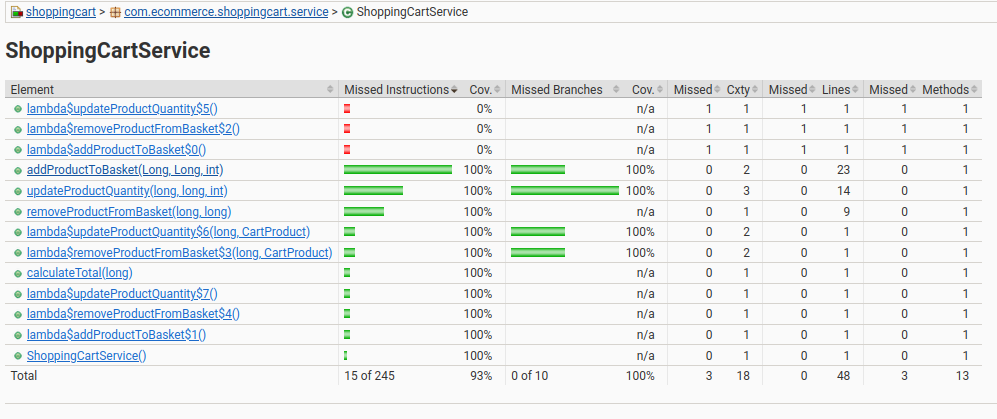

# Shopping Cart Application

Implemented a shopping cart application with given instructions. Used Spring Boot, JPA, Jacoco. Used h2 for database 

## Technical Design
Below flow chart folowed in development.


## Requirements
 In this assignment, you are only expected to focus on the shopping cart and discount functions.

You are expected to provide a dynamic and straightforward discount functionality. For example:

- When the cart total is **100 TL or more**, apply a **10% discount**.
- When the cart total is **200 TL or more**, apply a **15% discount**.

The number of discounts should be easily increased, removed entirely, or have their rates changed.

The REST API you provide should support at least the following functionalities:

1. Adding and removing products from the cart  
2. Updating the quantity of products in the cart  
3. Retrieving the total cart amount both with and without discounts

## Test and Proof
Implemented a rest controller for each service. These controllers controls only their own responsibility. Used springfox for swagger documentation and manual testing. Used Jacoco to see coverage result.

Swagger doc: http://localhost:8080/swagger-ui/index.html (Note: before running it you may need to set maven home path in maven setting)
```yaml
openapi: "3.0.1"
info:
  title: "OpenAPI definition"
  version: "v0"
servers:
  - url: "http://localhost:8080"
    description: "Generated server url"

paths:
  /customer/add:
    post:
      tags:
        - "customer-controller"
      operationId: "addCustomer"
      requestBody:
        content:
          application/json:
            schema:
              $ref: "#/components/schemas/Customer"
        required: true
      responses:
        "200":
          description: "OK"
          content:
            "*/*":
              schema:
                type: string

  /api/v1/cart/updateProductQuantity:
    post:
      tags:
        - "shopping-cart-controller"
      operationId: "updateProductQuantity"
      requestBody:
        content:
          application/json:
            schema:
              $ref: "#/components/schemas/CartProductDTO"
        required: true
      responses:
        "200":
          description: "OK"
          content:
            "*/*":
              schema:
                type: string

  /api/v1/cart/removeProduct:
    post:
      tags:
        - "shopping-cart-controller"
      operationId: "removeProductFromBasket"
      requestBody:
        content:
          application/json:
            schema:
              $ref: "#/components/schemas/CartProductDTO"
        required: true
      responses:
        "200":
          description: "OK"
          content:
            "*/*":
              schema:
                type: string

  /api/v1/cart/addProduct:
    post:
      tags:
        - "shopping-cart-controller"
      operationId: "addProductToBasket"
      requestBody:
        content:
          application/json:
            schema:
              $ref: "#/components/schemas/CartProductDTO"
        required: true
      responses:
        "200":
          description: "OK"
          content:
            "*/*":
              schema:
                type: string

  /customer/{id}:
    get:
      tags:
        - "customer-controller"
      operationId: "getCustomerById"
      parameters:
        - name: "id"
          in: "path"
          required: true
          schema:
            type: integer
            format: int64
      responses:
        "200":
          description: "OK"
          content:
            "*/*":
              schema:
                $ref: "#/components/schemas/Customer"

  /customer/:
    get:
      tags:
        - "customer-controller"
      operationId: "getAllCustomers"
      responses:
        "200":
          description: "OK"
          content:
            "*/*":
              schema:
                type: array
                items:
                  $ref: "#/components/schemas/Customer"

  /api/v1/cart/total/{basketId}:
    get:
      tags:
        - "shopping-cart-controller"
      operationId: "getCartTotal"
      parameters:
        - name: "basketId"
          in: "path"
          required: true
          schema:
            type: integer
            format: int64
      responses:
        "200":
          description: "OK"
          content:
            "*/*":
              schema:
                $ref: "#/components/schemas/PricesResponse"

components:
  schemas:
    Basket:
      type: object
      properties:
        basketId:
          type: integer
          format: int64
        customer:
          $ref: "#/components/schemas/Customer"
        basketItems:
          type: array
          items:
            $ref: "#/components/schemas/CartProduct"

    CartProduct:
      type: object
      properties:
        cartProductId:
          type: integer
          format: int64
        cartQuantity:
          type: integer
          format: int32
        cartPrice:
          type: number
          format: double
        product:
          $ref: "#/components/schemas/Product"
        basket:
          $ref: "#/components/schemas/Basket"

    Customer:
      type: object
      properties:
        customerId:
          type: integer
          format: int64
        customerEmail:
          type: string
        basket:
          $ref: "#/components/schemas/Basket"

    Product:
      type: object
      properties:
        productId:
          type: integer
          format: int64
        productName:
          type: string
        productPrice:
          type: number
          format: double

    CartProductDTO:
      type: object
      properties:
        basketId:
          type: integer
          format: int64
        productId:
          type: integer
          format: int64
        quantity:
          type: integer
          format: int32

    PricesResponse:
      type: object
      properties:
        totalPrice:
          type: number
          format: double
        discountPrice:
          type: number
          format: double
```

Jacoco result: http://localhost:63342/shopping-cart/shoppingcart/target/site/jacoco/index.html (Note: before running it, you may need to set maven home path in maven setting)



